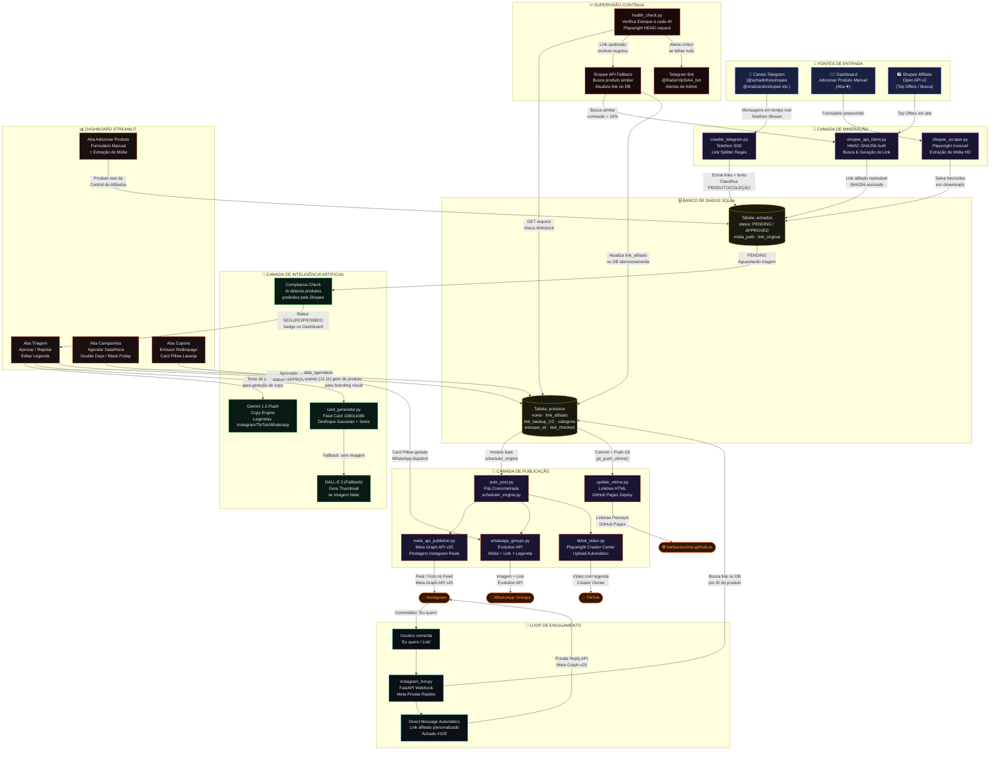

# 🗺️ Diagrama de Fluxo de Dados — SIAA-2026

## Fluxo Completo: Da Mineração à Publicação

---

## 🔑 Legenda dos Módulos

| Cor | Camada | Responsabilidade |
|---|---|---|
| 🔵 Azul | Fontes de Entrada | Telegram, API Shopee, formulário manual |
| 🟣 Roxo | Mineração | Scrapers, crawler Telethon, cliente de API |
| 🟡 Amarelo | Banco de Dados | SQLite — tabelas `achados` e `produtos` |
| 🟢 Verde | IA | Gemini, Pillow, DALL-E, Compliance |
| 🟠 Laranja | Dashboard | Triagem, agendamento, cupons |
| 🔵 Ciano | Engajamento | Auto-DM FastAPI, Private Replies |
| 🔴 Vermelho | Supervisão | HealthCheck, Fallback, Bot Telegram |

## ♾️ Loops Críticos do Sistema

1. **Loop de Anti-Esgotamento:** `health_check` → produto esgota → `shopee_api_client` busca similar → atualiza DB → ninguém percebe
2. **Loop de Viral:** Post no Reels → usuário comenta → `instagram_bot` detecta → manda link no Direct → algoritmo lê mais comentários → entrega para mais pessoas
3. **Loop de Aprovação:** Telegram/Manual → `achados PENDING` → Dashboard Triagem → IA processa → `produtos APPROVED` → fila de postagem
