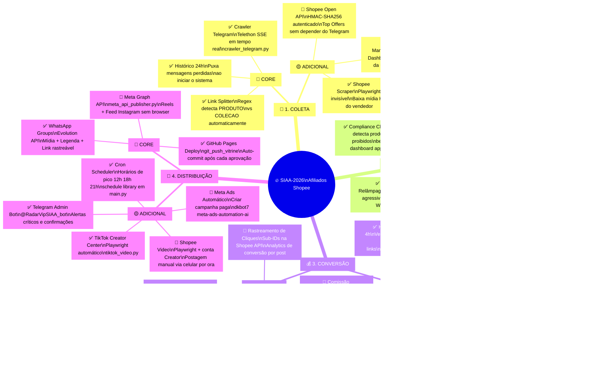

# 🗺️ Mapa de Funcionalidades — SIAA-2026

## Legenda
> - 🔴 **CORE** — Funcionalidade essencial. Sem ela o sistema não opera.
> - 🟡 **ADICIONAL** — Feature avançada que amplifica resultados.
> - ✅ **Implementado** — Código já existe e está ativo.
> - 🔧 **Parcial** — Implementado mas depende de config externa.
> - 🔲 **Planejado** — Arquitetado, aguarda ativação ou credenciais.

---

---

## 📊 Resumo de Status

| Pilar | Core ✅ | Core 🔧 | Adicional ✅ | Adicional 🔲 |
|---|:---:|:---:|:---:|:---:|
| 📡 Coleta | 3/3 | 0 | 2/3 | 1/3 |
| 🧠 Processamento | 4/4 | 0 | 4/4 | 0 |
| 💰 Conversão | 4/4 | 0 | 1/4 | 3/4 |
| 🚀 Distribuição | 1/3 | 2/3 | 3/4 | 2/4 |

> [!TIP]
> **O sistema está ~80% implementado.** Os 20% restantes são: rastreamento de cliques, comissão estimada no dashboard, Meta Ads pagos e automação total do Shopee Video via celular.

> [!IMPORTANT]
> **Prioridade para ir ao ar hoje:** Preencher `META_ACCESS_TOKEN` ativo no `.env` para ativar a Distribuição Core do Instagram. Todo o resto já está funcional.
